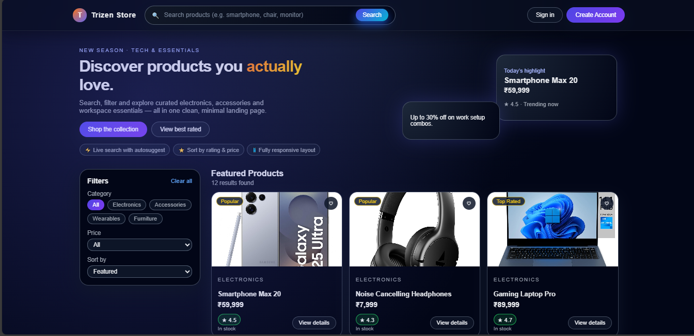
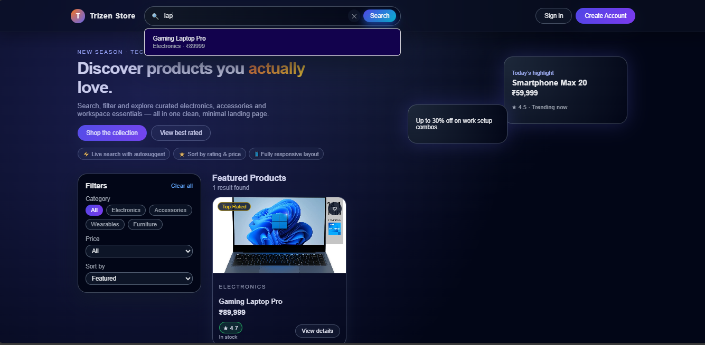
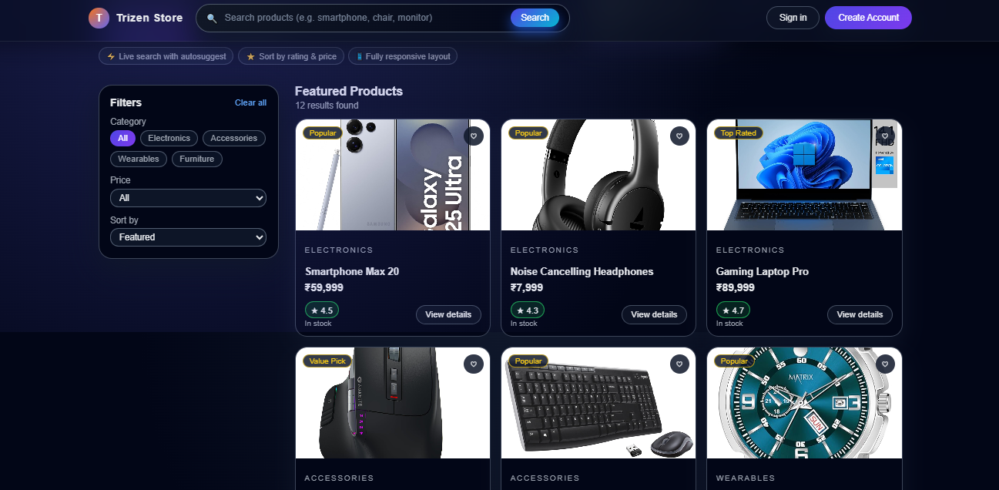

# MERN Product Landing Page – Trizen Ventures Assignment
https://mern-product-landing-frontend.onrender.com/

A modern product landing page built using the **MERN stack** with live search suggestions, category filters, responsive UI, and a professional visual design.

This project was created as part of the **Trizen Ventures MERN Developer Assignment**.

---

## 🚀 Features

### 🔍 Search
- Live search autosuggest (top 5 results)
- Debounced API search
- Smooth dropdown UI
- Suggestion click → Autofill search bar

### 🛒 Products
- Modern product grid with HD images
- Local image assets (fast loading)
- Category badges
- Wishlist toggle animation (♥)
- Rating, price & category visible
- Responsive layout (mobile/tablet/desktop)

### 🎨 UI & Design Enhancements
- Hero banner with gradient + glow effects
- Glassmorphism header
- Parallax hover animations
- Fade-in and slide-up transitions
- Soft shadows & depth layering
- Clean typography

### ⚙️ Backend
- Node.js + Express REST API
- MongoDB Atlas database
- `/products` endpoint
- `/search?q=` endpoint with limit=5
- CORS + environment variables

---

## 🧱 Tech Stack

### **Frontend**
- React (Vite)
- Axios
- Custom CSS
- Local asset images

### **Backend**
- Node.js
- Express.js
- Mongoose
- MongoDB Atlas

---

## 📁 Project Structure
mern-product-landing/
│
├── backend/
│   ├── index.js
│   ├── package.json
│   └── .env
│
├── frontend/
│   ├── src/
│   │   ├── components/
│   │   └── assets/products/
│   ├── package.json
│   └── vite.config.js
│
└── README.md

## 🛠 Setup Instructions
### **1. Clone the repository**
git clone https://github.com/kshithijsangam/mern-product-landing.git
cd mern-product-landing

### **2. Backend Setup**
cd backend
npm install

Create .env

MONGO_URI=your-mongodb-atlas-url
PORT=5000

Run server:

npm run dev

Backend runs on:
👉 http://localhost:5000

### **3. Frontend Setup**
cd frontend
npm install
npm run dev

Frontend runs on:
👉 http://localhost:5173

📸 Screenshots
### Homepage

### Search Suggestions

### Products Grid

📡 API Endpoints
GET /products

Returns all products.

GET /search?q=term

Returns up to 5 matching products.

📞 Contact

kshithijsangam
github.com/kshithijsangam
kshithijsangam200217@gmail.com
